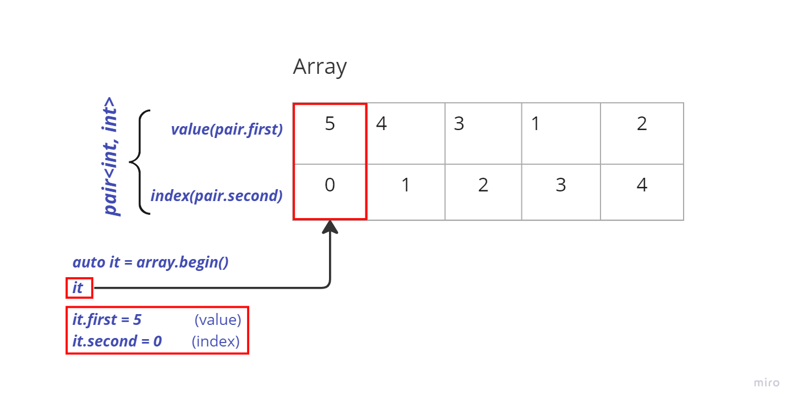
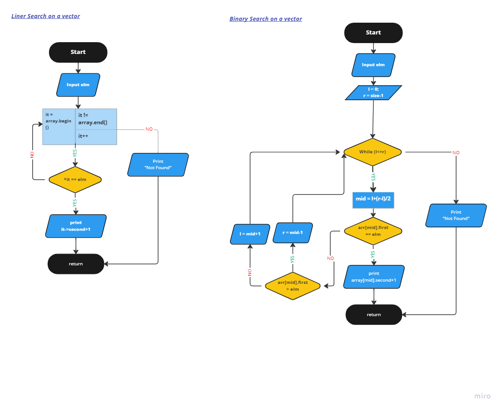

<h1># Vector&lt;pair&lt;int, int&gt;&gt; </h1>
 

<h1># Search Methods</h1>
 
<!-- -->

<iframe width="768" height="432" src="https://miro.com/app/live-embed/uXjVPPv71Nc=/?moveToViewport=-153,-688,1504,1214&embedId=633560076760" frameborder="0" scrolling="no" allowfullscreen></iframe>

